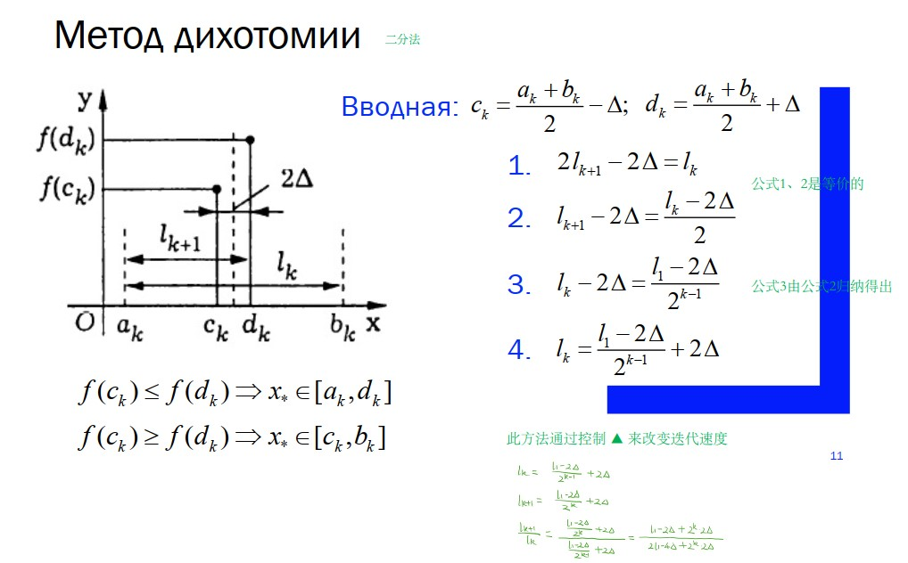
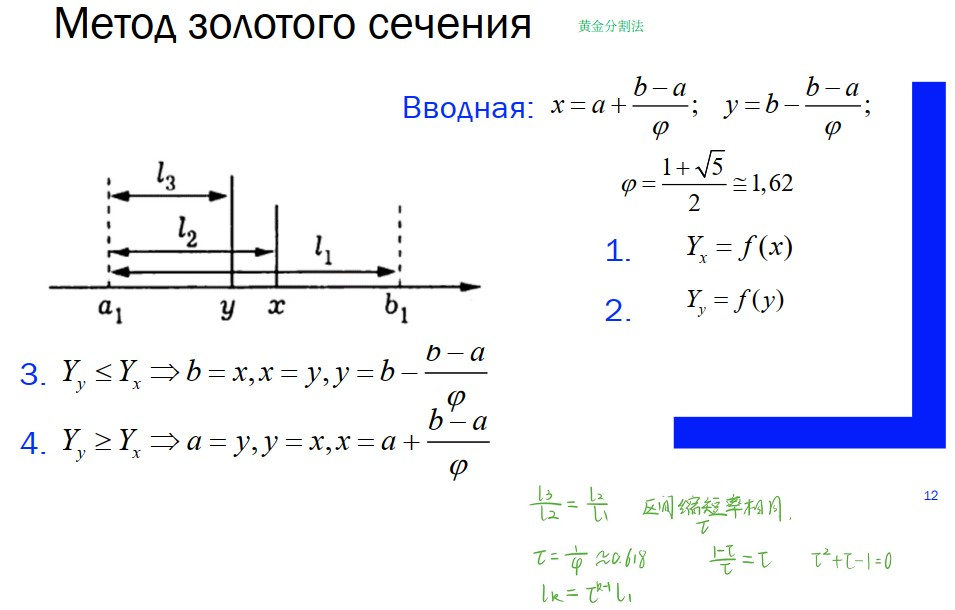

>参考书籍：
[1]精通MATLAB最优化计算第2版 by 龚纯，王正林
[2]最优化理论与算法 by 陈宝林
[3]数值最优化算法与理论(第二版) by 李董辉,童小娇,万中
[4]最优化理论与方法 by 袁亚湘 孙文瑜

最优化方法的一般流程 [4]P50
===

目标函数： $min f(x)$
最优化方法常用迭代法求最优解： 
&emsp;$x_{k+1}=x_{k}+a_{k}d_{k}$
$a_k$-步长因子，$d_k$搜索方向
给定初始条件$x_0$
1). 确定搜索方向$d_k$，即按一定规则，构造f(x)在$x_k$的下降方向(梯度)作为搜索方向；
2). 确定步长因子$a_k$，使目标函数有某种意义的下降；
3). 令
&emsp;&emsp;&emsp;&emsp;&emsp;$x_{k+1}=x_{k}+a_{k}d_{k}$
若$x_{k+1}$满足某种终止条件，则停止迭代，得到近似最优解$x_{k+1}$，否则重复步骤1)。

一维搜索问题
===

分类
---

&emsp; 一维搜索又叫线性搜索，指单变量函数的优化问题，分为

- 精确一维搜索：找出沿$d_k$方向，目标函数达极小的$a_k$
- 不精确一维搜索：找出沿$d_k$方向，目标函数有可接受下降量的$a_k$

一维搜索问题的一般流程
---

1). 确定包含问题最优解的搜索区间（可用“进退法”确定, [1]P95）;
2). 采用某种**分割方法**或者**插值方法**缩小搜索区间；
3). 进行搜索求解。
分割方法：二分法、0.618法（黄金分割法）、Fibonacci法...(分割方法可以说并没有采用上述“最优化方法的一般流程”，)
插值方法：二次插值、三次插值

二分法
---

$\Delta$ 人为设定
若$f(c_k)\leqslant f(d_k), [a_{k+1},b_{k+1}]=[a_k,d_k]$，否则$[a_{k+1},b_{k+1}]=[c_k,b_k]$

0.618法（黄金分割法）
---
